  

  

## 📊 GitHub Stats & Trophies

  
  

  

  

  

## 🛠️ Languages & Tools

> ## Programming Languages

    

> ## Frontend

    

> ## Backend

  

> ## Database

 

> ## DevOps & Cloud

> ## Tools

   

  

## 🔗 Connect with Me

 

  

